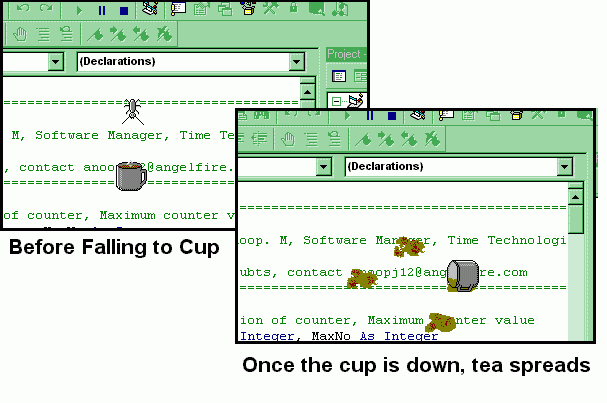

## Ant And Teacup: A 'teacup' and a naughty ant for your 'desktop'

### Description

ANT AND TEACUP: Hi Folks, Ever thought about placing a TEA CUP in Windows DESKTOP? Here is the a real TEA CUP for you to place on your 'Desktop'. BUT BEWARE: There is an ANT that will always try to turn the Tea Cup down. If it falls down, Tea will flow out and clutter your screen. Very interesting and cool code, great idea and good graphics. It will teach you 1) How to create a transparent form 2) How to implement desktop animation and 3) How to play a trick on your friends. A LAST WORD, PLEASE VOTE FOR ME if you love cool ideas. Sindabad Planet-Source-Code, Sindabad Visual Basic (*Sindabad means win for ever). Regards - Anoop M, anoopj12@angelfire.com
 
### More Info
 
A Cup full of tea

Kindly visit http://www.geocities.com/streamingaudio for details regarding some technologies I developed. Also download my other codes (like the hit Icon Hunter), if you love my coding style. Thanks

Blames from your mother/wife for wasting the tea and cluttering your desktop

Your mom/wife may not give you any tea more for the day

             |
---                |---
**Submitted On**   |2000-05-28 11:34:36
**By**             |[Anoop Madhusudanan](https://github.com/Planet-Source-Code/PSCIndex/blob/master/ByAuthor/anoop-madhusudanan.md)
**Level**          |Intermediate
**User Rating**    |4.7 (132 globes from 28 users)
**Compatibility**  |VB 5\.0, VB 6\.0
**Category**       |[Jokes/ Humor](https://github.com/Planet-Source-Code/PSCIndex/blob/master/ByCategory/jokes-humor__1-40.md)
**World**          |[Visual Basic](https://github.com/Planet-Source-Code/PSCIndex/blob/master/ByWorld/visual-basic.md)
**Archive File**   |[CODE\_UPLOAD61835282000\.zip](https://github.com/Planet-Source-Code/anoop-madhusudanan-ant-and-teacup-a-teacup-and-a-naughty-ant-for-your-desktop__1-8420/archive/master.zip)

### API Declarations

Kindly see the program

